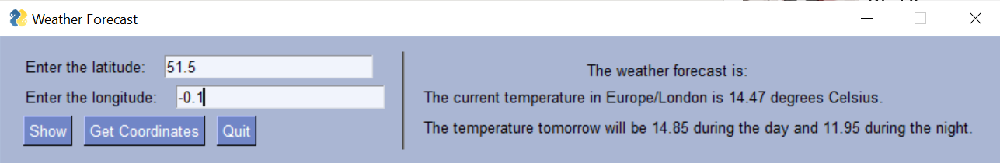

# Python Weather Appplication

## Description

This application provides a simple interface to check the current weather and a five-day forecast for a given location worldwide. It allows you to search by city or coordinates, using the [OpenWeatherMap](https://openweathermap.org) API, and save favourite cities. 

## Installation Instructions

1. Clone the repository:
```
git clone https://github.com/vladcranga/python-weather.git
```

2. Navigate to the project directory:
```
cd python-weather
```

3. Create a virtual environment:
```
python -m venv venv
```

4. Activate the virtual environment:
- On Windows:
  ```
  venv\Scripts\activate
  ```
- On macOS/Linux:
  ```
  source venv/bin/activate
  ```

5. Install the required packages:
```
pip install -r requirements.txt
```

6. Add your (free) API key from [openweathermap](https://openweathermap.org) to `.env`, which you create in python-weather:
```
OPENWEATHER_API_KEY=your_api_key
```

## How to run the application
Enter 
```
python -m weather.main
```
in the **python-weather** directory.

## Features:
- **City Search**: Enter the name of a city to retrieve weather data.
- **Coordinates Search**: Enter latitude and longitude to get weather information for a specific location.
- **Favourite Cities**: Save cities by clicking on "Save to Favourites". Saved cities will be available on launch.
- **Five-Day Forecast**: View an extended five-day weather forecast below the current weather details.
- **Get Coordinates**: Use the "Get Coordinates" button to open a web tool that helps find the latitude and longitude for a location.



## Credits

- GUI weather icon by iconixar from [Flaticon](https://www.flaticon.com/free-icons/weather).

## Licence

This project is licensed under the [MIT Licence](https://opensource.org/license/MIT).

